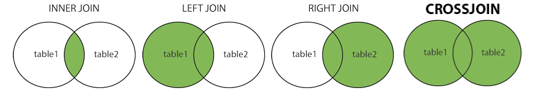
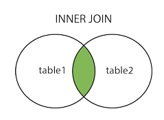
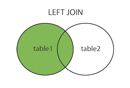
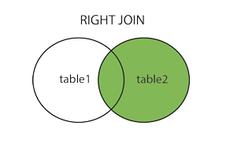

# JOINS

> A `JOIN` clause is used to combine rown from two or more tables, based on a related cloumn between them.

## Supported types of JOINS 
* `INNER JOIN`: Returns records that have matching values in both tables;
* `LEFT JOIN`: Returns all records from the left table, and the matched records from the right table;
* `RIGHT JOIN`: Returns all records from the right table, and the matched records from the left table;
* `CROSS JOIN`: Returns all records from both tables;

<br>

<center>



</center>

<br>

## `INNER JOIN` 

The INNER JOIN keyword selects records that have matching values in both tables.

<center>



</center>

Syntax:

```SQL
SELECT column_name(s)
FROM table1
INNER JOIN table2
ON table1.column_name = table2.column_name;
```

<br>

## `LEFT JOIN` 

The LEFT JOIN keyword returns all records from the left table (table1), and the matching records (if any) from the right table (table2).

<center>



</center>

Syntax:

```SQL
SELECT column_name(s)
FROM table1
LEFT JOIN table2
ON table1.column_name = table2.column_name;
```
<br>

## `RIGHT JOIN` 

The RIGHT JOIN keyword returns all records from the right table (table2), and the matching records (if any) from the left table (table1).

<center>



</center>

Syntax:

```SQL
SELECT column_name(s)
FROM table1
RIGHT JOIN table2
ON table1.column_name = table2.column_name;
```

<br>

## `CROSS JOIN` 

A self join is a regular join, but the table is joined with itself.

Syntax:

```SQL
SELECT column_name(s)
FROM table1 T1, table1 T2
WHERE condition;
```
